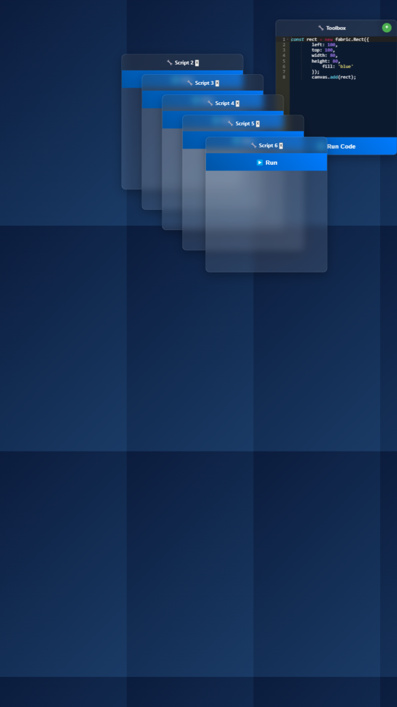

# Fabric.js Dev Toolbox

A dynamic canvas development environment built with Fabric.js and Ace editor for rapid prototyping and debugging.

## Features

- Interactive Fabric.js canvas with responsive design
- Draggable toolbox with JavaScript execution
- Syntax-highlighted code editor (Ace)
- Create multiple independent toolboxes
- Mobile-friendly interface

## Usage

You can use the app on this link
[https://fedmich.github.io/FabricJs-Tester/](https://fedmich.github.io/FabricJs-Tester/)

## Usage 2
1. Clone the repo
2. Open `index.html` in a browser
3. Write Fabric.js code in any toolbox
4. Click "Run" to execute

## Structure

- `index.html` - Main page
- `app.js` - Application logic
- `styles.css` - Styling   

   
